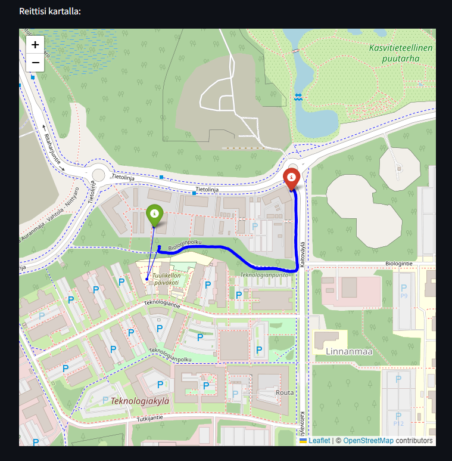

# Urheilusovellusprototyyppi - Analyysi ja visualisointi

## Projektin Yleiskuvaus

Urheilusovellusprototyyppi on Python-pohjainen sovellus, joka analysoi ja visualisoi urheilusuorituksia perustuen kiihtyvyys- ja GPS-dataan. Sovellus käyttää erilaisia signaalinkäsittelytekniikoita askelmien laskemiseen, matkojen mittaamiseen ja käyttäjän liikkeen visualisoimiseen kartalla. Tämän projektin avulla käyttäjät voivat paremmin ymmärtää suoritustaan ja parantaa harjoitteluunsa liittyvää tietämystään.

## Vaaditut Kirjastot

Tämän projektin suorittamiseen tarvitset seuraavat Python-kirjastot. Voit asentaa ne pipin avulla:

```bash
pip install pandas numpy matplotlib scipy geopy streamlit folium streamlit-folium
```
## Sovelluksen voit ajaa seuraavasti projektin kansiosta joka avaa Streamlit sovelluksen nettiselaimelle
```bash
python -m streamlit run gps.py
```

## Projektin kuvia




## Kuten kuvasta huomaa reitti on piirretty oikein missä kuljin, mutta mittauksen alussa signaali oli heikko ja heitteli. 
